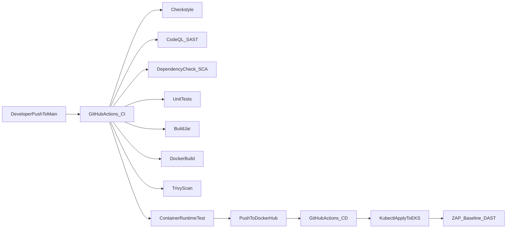

# Basic Spring Boot Application with CI/CD

A production-ready Spring Boot application with a comprehensive CI/CD pipeline implementing DevSecOps best practices.

## Application Overview

This is a simple Spring Boot application that exposes a REST API endpoint `/greetings` that returns a JSON greeting message.

### Technology Stack

- **Java**: 21
- **Spring Boot**: 3.2.0
- **Build Tool**: Maven
- **Container**: Docker (multi-stage build)
- **Orchestration**: Kubernetes
- **CI/CD**: GitHub Actions

## Local Development

### Prerequisites

- Java 21 or higher
- Maven 3.9 or higher
- Docker (for containerized runs)

### Running Locally

#### Using Maven

```bash
# Build the application
mvn clean package

# Run the application
java -jar target/basic-springboot-app-1.0.0.jar

# Or run directly with Maven
mvn spring-boot:run
```

The application will start on `http://localhost:8080`

#### Testing the Endpoint

```bash
curl http://localhost:8080/greetings
```

Expected response:
```json
{
  "message": "Hello from Spring Boot"
}
```

#### Running Tests

```bash
mvn test
```

### Running with Docker

#### Build the Docker Image

```bash
docker build -t basic-springboot-app:local .
```

#### Run the Container

```bash
docker run -p 8080:8080 basic-springboot-app:local
```

#### Test the Container

```bash
curl http://localhost:8080/greetings
```

## CI/CD Pipeline Architecture



## CI Pipeline Stages (.github/workflows/ci.yml)

The CI pipeline runs on every push to `main` branch and can also be triggered manually via `workflow_dispatch`.

### Stage-by-Stage Breakdown

| Stage | Tool | Purpose | Risk Mitigated |
|-------|------|---------|----------------|
| **Checkout** | `actions/checkout@v4` | Retrieve source code from repository | Ensures consistent codebase access |
| **Setup Runtime** | `actions/setup-java@v4` | Install Java 21 and configure Maven with dependency caching | Prevents version drift, speeds up builds |
| **Linting** | Maven Checkstyle Plugin | Enforce coding standards and conventions | Prevents technical debt, improves maintainability |
| **SAST** | GitHub CodeQL | Static Application Security Testing - detects code-level vulnerabilities | Identifies OWASP Top 10 issues before deployment |
| **SCA** | OWASP Dependency-Check | Software Composition Analysis - scans dependencies for known CVEs | Prevents supply-chain attacks from vulnerable libraries |
| **Unit Tests** | JUnit 5 | Validate business logic and prevent regressions | Ensures code correctness and prevents breaking changes |
| **Build** | Maven | Package application into JAR artifact | Creates deployable artifact deterministically |
| **Docker Build** | Docker Buildx | Create container image with multi-stage build | Ensures consistent runtime environment |
| **Image Scan** | Trivy | Scan container image for OS and library vulnerabilities | Prevents shipping vulnerable container images |
| **Runtime Test** | Docker + curl | Validate container behavior by running and testing endpoint | Ensures container is runnable and functional |
| **Registry Push** | Docker Buildx | Publish trusted image to DockerHub | Enables downstream deployment (CD pipeline) |

### Why Each Stage Exists

1. **Linting (Checkstyle)**: Catches code quality issues early, enforces team standards, and reduces code review time. Prevents accumulation of technical debt.

2. **SAST (CodeQL)**: Shifts security left by detecting vulnerabilities at code level before they reach production. Identifies common patterns like SQL injection, XSS, insecure deserialization.

3. **SCA (Dependency-Check)**: Critical for supply-chain security. Many vulnerabilities come from transitive dependencies. This stage ensures we're aware of and can remediate known CVEs in dependencies.

4. **Unit Tests**: Provides confidence that code changes don't break existing functionality. Essential for maintaining code quality and preventing regressions.

5. **Trivy Image Scan**: Container images can have vulnerabilities in base OS packages or installed libraries. This gate ensures we don't deploy images with known critical/high CVEs.

6. **Runtime Test**: Validates that the containerized application actually works. Catches issues like misconfigured ports, missing environment variables, or startup failures.

7. **DockerHub Push**: Only executed after all quality gates pass. This ensures only trusted, validated images are available for deployment.

### Image Tagging Strategy

- **Immutable tags**: `sha-<short-commit-sha>` (e.g., `sha-abc1234`)
- **Latest tag**: `latest` (only on default branch)

This ensures traceability and prevents accidental overwrites.

## CD Pipeline Stages (.github/workflows/cd.yml)

The CD pipeline deploys the application to AWS EKS and performs a DAST scan.

### Trigger Strategy

- **Manual**: `workflow_dispatch` with `image_tag` input parameter
- **Automatic**: After successful CI pipeline run (via `workflow_run`)

### Stage-by-Stage Breakdown

| Stage | Purpose | Risk Mitigated |
|-------|---------|----------------|
| **AWS Authentication** | Configure AWS credentials for EKS access | Enables secure cluster access |
| **Kubeconfig Setup** | Configure kubectl to connect to EKS cluster | Establishes connection to target cluster |
| **Deploy to Kubernetes** | Apply Deployment and Service manifests | Deploys application to production-like environment |
| **Wait for Rollout** | Ensure deployment completes successfully | Prevents partial deployments |
| **DAST Scan** | OWASP ZAP baseline scan against live service | Identifies runtime security issues |

### DAST (Dynamic Application Security Testing)

The CD pipeline includes a lightweight DAST scan using OWASP ZAP baseline scan:

- **Method**: Port-forward to the deployed service and scan `http://127.0.0.1:8080/greetings`
- **Tool**: OWASP ZAP (`owasp/zap2docker-stable`)
- **Limitations**:
  - Baseline scan only (not full scan)
  - Single endpoint tested
  - Port-forward constraints (not true production traffic)
  - Findings are informational; can be configured to gate on high/critical findings

## GitHub Secrets Configuration

### CI Pipeline Secrets

Configure the following secrets in your GitHub repository (`Settings > Secrets and variables > Actions`):

| Secret Name | Description | How to Obtain |
|-------------|-------------|---------------|
| `DOCKERHUB_USERNAME` | Your DockerHub username | DockerHub account settings |
| `DOCKERHUB_TOKEN` | DockerHub access token | DockerHub > Account Settings > Security > New Access Token |

### CD Pipeline Secrets

| Secret Name | Description | How to Obtain |
|-------------|-------------|---------------|
| `AWS_ACCESS_KEY_ID` | AWS access key for EKS access | AWS IAM > Users > Security credentials |
| `AWS_SECRET_ACCESS_KEY` | AWS secret access key | AWS IAM > Users > Security credentials |
| `AWS_REGION` | AWS region where EKS cluster exists | e.g., `us-east-1` |
| `EKS_CLUSTER_NAME` | Name of your EKS cluster | AWS EKS console |
| `K8S_NAMESPACE` | Kubernetes namespace (optional, defaults to `default`) | Your cluster configuration |

**⚠️ Security Note**: Never commit secrets to the repository. Always use GitHub Secrets.

## Kubernetes Deployment

### Manifests

The `k8s/` directory contains:

- `deployment.yml`: Kubernetes Deployment with 2 replicas, resource limits, and health probes
- `service.yml`: ClusterIP Service exposing the application internally
- `ingress.yml`: Optional Ingress resource (requires ingress controller and DNS configuration)

### Deploying Manually

```bash
# Set your image tag
export IMAGE_TAG=sha-abc1234
export DOCKERHUB_USERNAME=your-username

# Update deployment manifest
sed -i "s|DOCKERHUB_USERNAME|${DOCKERHUB_USERNAME}|g" k8s/deployment.yml
sed -i "s|IMAGE_TAG|${IMAGE_TAG}|g" k8s/deployment.yml

# Apply manifests
kubectl apply -f k8s/deployment.yml
kubectl apply -f k8s/service.yml

# Check status
kubectl get pods -l app=basic-springboot-app
kubectl get svc -l app=basic-springboot-app
```

## Security & Quality Controls

### Shift-Left Security

- **SAST**: Code-level security scanning (CodeQL)
- **SCA**: Dependency vulnerability scanning (OWASP Dependency-Check)
- **Container Scanning**: Image-level security scanning (Trivy)
- **DAST**: Runtime security testing (OWASP ZAP)

### Quality Gates

- **Linting**: Code style enforcement
- **Tests**: Unit test execution (must pass)
- **Build**: Successful compilation and packaging
- **Runtime Validation**: Container smoke tests

### GitHub Security Tab

Security findings from CodeQL, Dependency-Check, and Trivy are automatically uploaded to GitHub Security tab as SARIF files, providing:

- Centralized security dashboard
- Vulnerability tracking
- Remediation guidance
- Integration with Dependabot

## Project Structure

```
.
├── .github/
│   └── workflows/
│       ├── ci.yml          # CI pipeline
│       └── cd.yml          # CD pipeline
├── k8s/
│   ├── deployment.yml      # Kubernetes Deployment
│   ├── service.yml         # Kubernetes Service
│   └── ingress.yml         # Optional Ingress
├── src/
│   ├── main/
│   │   └── java/
│   │       └── com/example/basicspringbootapp/
│   │           ├── BasicSpringbootAppApplication.java
│   │           └── controller/
│   │               └── GreetingController.java
│   └── test/
│       └── java/
│           └── com/example/basicspringbootapp/
│               ├── BasicSpringbootAppApplicationTests.java
│               └── controller/
│                   └── GreetingControllerTest.java
├── Dockerfile              # Multi-stage Dockerfile
├── pom.xml                 # Maven configuration
├── checkstyle.xml          # Checkstyle configuration
└── README.md               # This file
```

## Limitations & Future Improvements

### Current Limitations

1. **DAST Scope**: Limited to baseline scan of single endpoint
2. **Kubernetes**: No Helm charts or advanced deployment strategies (blue-green, canary)
3. **Monitoring**: No observability stack (Prometheus, Grafana)
4. **Secrets Management**: Kubernetes secrets are not managed via external secret manager
5. **Multi-environment**: Single environment deployment (production only)

### Potential Improvements

1. **Enhanced DAST**: Full OWASP ZAP scan with spider/crawler
2. **GitOps**: ArgoCD or Flux for declarative deployments
3. **Advanced Deployment**: Implement blue-green or canary deployments
4. **Observability**: Integrate Prometheus, Grafana, and distributed tracing
5. **Secrets Management**: Integrate with AWS Secrets Manager or HashiCorp Vault
6. **Multi-environment**: Support dev, staging, and production environments
7. **Performance Testing**: Add load testing stage in CI/CD
8. **Compliance**: Add compliance scanning (e.g., CIS benchmarks)

## Troubleshooting

### CI Pipeline Fails

1. **Checkstyle failures**: Review `checkstyle.xml` and fix code style issues
2. **CodeQL findings**: Review Security tab and remediate vulnerabilities
3. **Dependency-Check failures**: Update vulnerable dependencies
4. **Test failures**: Fix failing unit tests
5. **Docker build failures**: Check Dockerfile syntax and base image availability
6. **Trivy findings**: Update base image or patch vulnerable packages

### CD Pipeline Fails

1. **AWS authentication**: Verify AWS credentials are correct
2. **EKS connection**: Ensure EKS cluster name and region are correct
3. **Image pull errors**: Verify image tag exists in DockerHub and is accessible
4. **Deployment failures**: Check Kubernetes manifests and resource limits
5. **DAST scan failures**: Review ZAP report artifacts

## License

This project is provided as-is for educational and demonstration purposes.

## Author

Created as part of Advanced DevOps CI/CD Project assessment.
